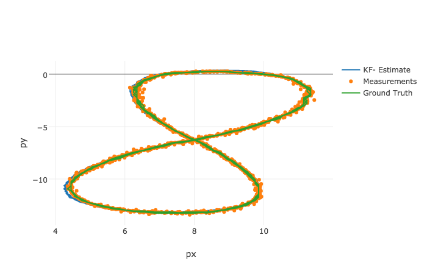
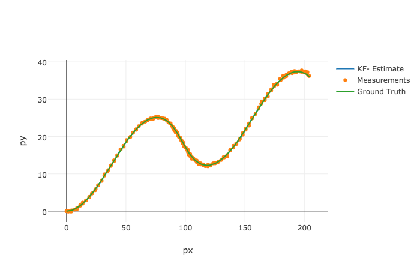

# Extended Kalman Filter 

---

### Dependencies

* cmake >= 3.5
* All OSes: [click here for installation instructions](https://cmake.org/install/)
* make >= 4.1
* Linux: make is installed by default on most Linux distros
* Mac: [install Xcode command line tools to get make](https://developer.apple.com/xcode/features/)
* Windows: [Click here for installation instructions](http://gnuwin32.sourceforge.net/packages/make.htm)
* gcc/g++ >= 5.4
* Linux: gcc / g++ is installed by default on most Linux distros
* Mac: same deal as make - [install Xcode command line tools]((https://developer.apple.com/xcode/features/)
* Windows: recommend using [MinGW](http://www.mingw.org/)

### Build Instructions

1. Clone this repo.
2. Make a build directory: `mkdir build && cd build`
3. Compile: `cmake .. && make` 
* On windows, you may need to run: `cmake .. -G "Unix Makefiles" && make`
4. Run it: `./ExtendedKF path/to/input.txt path/to/output.txt`. You can find
some sample inputs in 'data/'.
- eg. `./ExtendedKF ../data/sample-laser-radar-measurement-data-1.txt output.txt`

### Build Instructions (xcode)

1. Clone this repo.
2. Make a build directory: `mkdir xcode-build && cd xcode-build`
3. Run: `cmake -G Xcode ../` 
4. Open `ExtendedKF.xcodeproj` in xcode   

### Generating Additional Data

If you'd like to generate your own radar and lidar data, see the
[utilities repo](https://github.com/udacity/CarND-Mercedes-SF-Utilities) for
Matlab scripts that can generate additional data.

### Visualization of the output data

**Input data 1**: data/input/sample-laser-radar-measurement-data-1.txt 

**Input data 2**: data/input/sample-laser-radar-measurement-data-2.txt 

